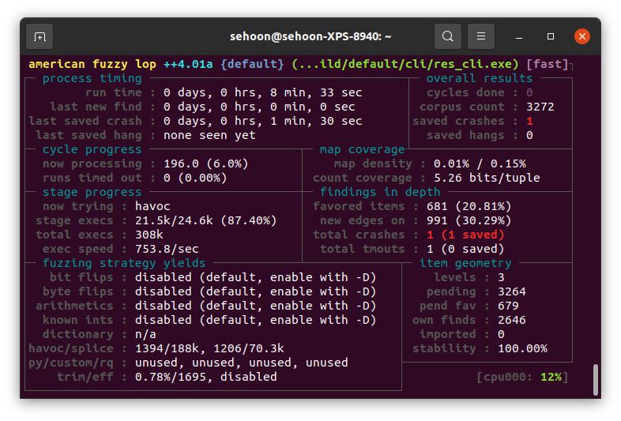

# Fuzz ReScript parser

This is an example repository of a [fuzing tutorial](https://sehun0819.github.io/blog/fuzz-rescript-parser/). If you want to find more detailed manual, please refer to it. For now, this instruction has only been demonstrated in Linux(Ununtu 20.04).

## Setup

#### Prerequisite

- Install AFL++.
  ```sh
  sudo apt-get update
  sudo apt-get -y install afl++
  ```

- Install opam.
  ```sh
  apt-get update
  apt-get install ocaml opam
  ```

- Install AFL version of OCaml compiler.
  ```sh
  opam switch create afl411 4.11.2+afl
  eval $(opam env)
  ```

#### Build ReScript parser and prepare fuzzing inputs

- Clone this repo. You should clone with `--recursive` flag, as this repo includes ReScript parser as well as other ReScript projects for being used as fuzz seeds.
  ```sh
  git clone --recursive git@github.com:Sehun0819/fuzz-rescript-parser.git
  ```
- Build ReScript parser.
  ```sh
  cd fuzz-rescript-parser
  make parser
  ```

- Prepare seed pool(fuzzing inputs).
  ```sh
  make corpus
  ```

## Fuzz ReScript parser

- Start fuzzing.
  ```sh
  make fuzz
  ```
  You will see an interface like below, which shows you fuzzing status.
  

- Fuzzed inputs can be found in `~/fuzz_report/default/crashes/`. Execute parser with found input to detect bugs. To trace a call stack, activate an OCaml flag.
  ```sh
  export OCAMLRUNPARAM=b
  ~/syntax/_build/default/cli/res_cli.exe ~/fuzz_report/default/crashes/<fuzzed input>
  ```